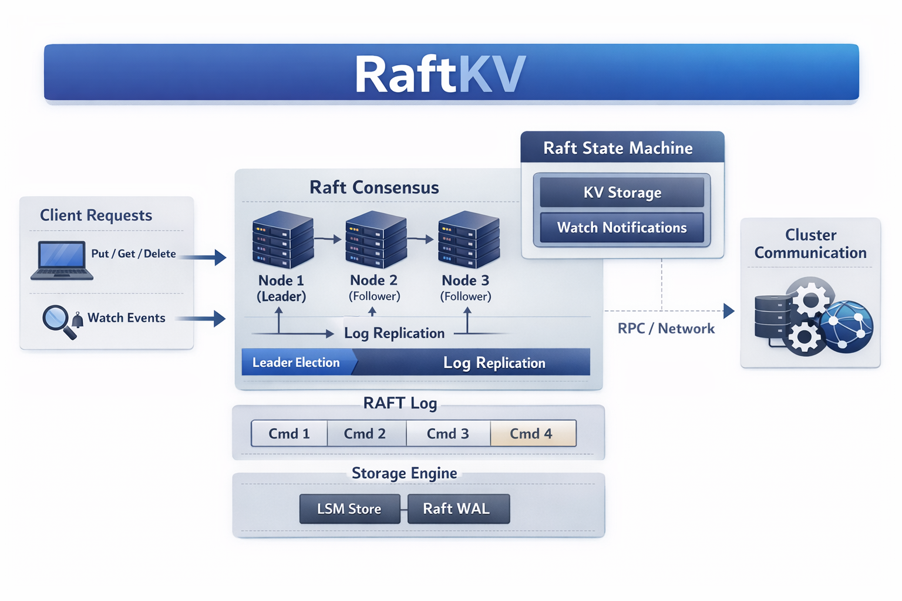
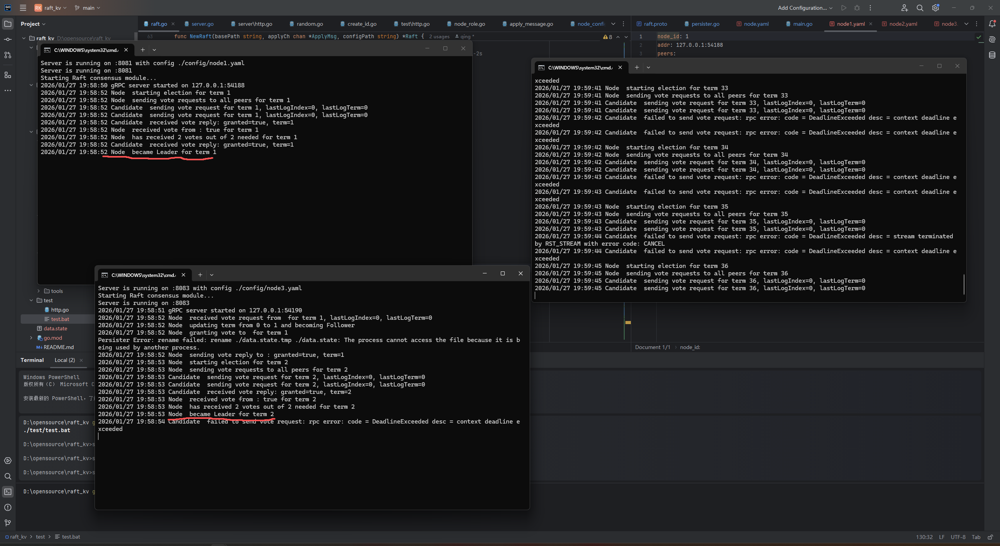
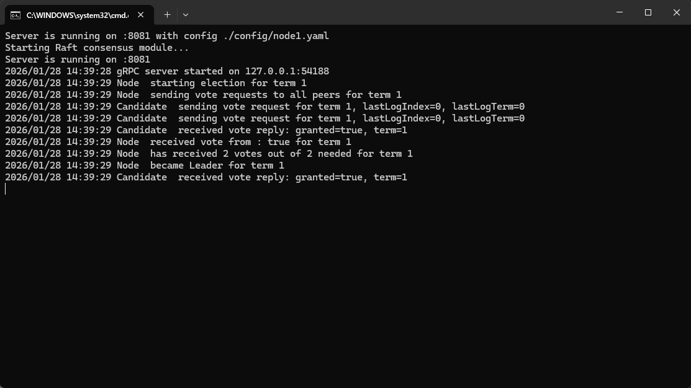

# Raft KV 项目展示

## 1. 项目简介
Raft KV 是一个基于 Raft 共识算法的分布式键值存储系统，支持多节点部署、自动故障转移和数据一致性保证。该系统采用 Go 语言开发，使用 gRPC 进行节点间通信，提供 HTTP 接口供客户端访问。

**核心特点：**
- 基于 Raft 共识算法，保证数据一致性
- 支持多节点部署和自动故障转移
- 实现快照机制，优化数据同步效率
- 采用 gRPC 进行高效的节点间通信
- 提供简洁的 HTTP 接口
- 支持持久化存储，确保数据安全

## 2. 技术栈
| 技术/框架 | 用途 |
|---------|------|
| Go | 主要开发语言 |
| gRPC | 节点间通信 |
| Protocol Buffers | 数据序列化 |
| HTTP | 客户端接口 |
| Raft | 共识算法实现 |
| 持久化存储 | 数据持久化 |

## 3. 系统架构


### 核心组件
- **Server**：HTTP 服务器，处理客户端请求，通过 Raft 提交写入命令
- **Raft**：共识模块，实现 Raft 算法，包括 Leader 选举、日志复制和快照机制
- **Store**：存储模块，作为状态机，处理来自 Raft 的命令
- **gRPC 通信**：节点间的网络通信，实现 Raft 的 RPC 方法
- **持久化**：保存 Raft 状态和日志，支持节点重启后恢复

## 4. 功能说明

### 4.1 基本操作
| 操作 | HTTP 方法 | URL | 请求体 | 响应 |
|------|---------|-----|-------|------|
| 写入数据 | POST | /kv | `{"key": "foo", "value": "bar"}` | `{"ok": true}` |
| 读取数据 | GET | /kv?key=foo | N/A | `{"key": "foo", "value": "bar"}` |
| 删除数据 | DELETE | /kv?key=foo | N/A | `{"ok": true}` |

### 4.2 共识机制
- **Leader 选举**：当节点启动或 Leader 故障时，自动进行 Leader 选举
- **日志复制**：Leader 将日志复制到 Follower 节点，确保数据一致性
- **故障转移**：当 Leader 故障时，自动选举新 Leader，保证系统可用性
- **快照机制**：支持通过 InstallSnapshot RPC 同步快照，减少网络传输

### 4.3 持久化功能
- **Raft 状态持久化**：保存当前 term、votedFor 和日志条目
- **快照持久化**：保存状态机快照，支持快速恢复
- **节点重启恢复**：节点重启后从持久化存储中恢复状态

## 5. 代码结构
```
raft_kv/
├── cmd/
│   └── server/
│       └── main.go          # 服务器入口
├── config/
│   ├── node1.yaml           # 节点 1 配置
│   ├── node2.yaml           # 节点 2 配置
│   └── node3.yaml           # 节点 3 配置
├── internal/
│   ├── consensus/           # Raft 共识模块
│   │   ├── raft.go          # Raft 核心实现
│   │   ├── log_entry.go     # 日志管理
│   │   ├── node_config.go   # 节点配置
│   │   ├── proto/           # gRPC 协议
│   │   └── persister.go     # 持久化实现
│   ├── server/              # HTTP 服务器
│   │   ├── server.go        # 服务器实现
│   │   └── http.go          # HTTP 处理
│   └── store/               # 存储模块
│       └── memory/
│           └── store.go     # 内存存储
├── go.mod                   # Go 模块文件
├── go.sum                   # 依赖校验
└── README.md                # 项目说明
```

## 6. 核心组件详解

### 6.1 Raft 共识模块
- **Leader 选举**：实现了完整的 Raft 选举流程，包括随机超时、投票收集和任期管理
- **日志复制**：通过 AppendEntries RPC 复制日志，确保所有节点数据一致
- **快照机制**：支持创建和应用快照，优化数据同步效率
- **故障转移**：自动检测 Leader 故障并选举新 Leader，保证系统可用性
- **持久化**：将 Raft 状态和日志持久化到磁盘，支持节点重启后恢复

### 6.2 存储模块
- **内存存储**：基于 Go map 的内存存储实现，提供高效的读写操作
- **快照支持**：支持创建和应用快照，配合 Raft 的快照机制
- **并发安全**：使用互斥锁保证并发安全，支持多客户端同时访问

### 6.3 HTTP 服务器
- **RESTful API**：提供简洁的 HTTP 接口，方便客户端访问
- **命令提交**：通过 Raft 提交写入命令，确保数据一致性
- **结果等待**：使用 channel 等待命令提交完成后响应客户端，保证操作的原子性

## 7. 成功场景截图


### 节点启动成功 Leader选举成功 写入操作成功(非leader)
.png)

### 节点启动成功 Leader选举成功 写入操作成功(leader)
.png)

## 8. 失败场景截图

### 脑裂问题


### 死锁问题


## 9. 核心代码展示

### Raft 核心实现
```go
// InstallSnapshot 处理来自 Leader 的快照安装请求
func (raft *Raft) InstallSnapshot(ctx context.Context, req *pb.InstallSnapshotArgs) (*pb.InstallSnapshotReply, error) {
    raft.mu.Lock()
    defer raft.mu.Unlock()
    
    // 检查任期
    if req.Term < raft.currentTerm {
        return &pb.InstallSnapshotReply{Term: raft.currentTerm}, nil
    }
    
    // 更新状态
    if req.Term > raft.currentTerm {
        raft.currentTerm = req.Term
        raft.votedFor = -1
        raft.state = Follower
        raft.persist()
    }
    
    // 应用快照
    raft.lastIncludedIndex = req.LastIncludedIndex
    raft.lastIncludedTerm = req.LastIncludedTerm
    raft.logMgr.ResetWithSnapshot(req.LastIncludedIndex, req.LastIncludedTerm)
    raft.commitIndex = req.LastIncludedIndex
    raft.lastApplied = req.LastIncludedIndex
    
    // 应用快照数据到状态机
    raft.applySnapshot(req.Data)
    return &pb.InstallSnapshotReply{Term: raft.currentTerm}, nil
}
```

### 持久化实现
```go
// persist 持久化 Raft 状态
func (raft *Raft) persist() {
    data := raft.encodeState()
    raft.persister.SaveRaftState(data)
    raft.persister.SaveLogEntries(raft.logMgr.GetEntries())
}

// loadState 从持久化存储加载状态
func (raft *Raft) loadState() {
    data := raft.persister.ReadRaftState()
    if data != nil {
        raft.decodeState(data)
    }
    
    entries := raft.persister.ReadLogEntries()
    if entries != nil {
        raft.logMgr.SetEntries(entries)
    }
}
```

### HTTP 处理
```go
// handlePut 处理 PUT 请求
func (s *Server) handlePut(w http.ResponseWriter, r *http.Request) {
    var req PutReq
    if err := json.NewDecoder(r.Body).Decode(&req); err != nil {
        http.Error(w, "invalid request", http.StatusBadRequest)
        return
    }
    
    cmd := store.Command{
        Op:    "put",
        Key:   req.Key,
        Value: []byte(req.Value),
    }
    cmdBytes, _ := json.Marshal(cmd)
    
    // 通过 Raft 提交命令
    resultCh := make(chan *consensus.ApplyMsg, 1)
    _, _, isLeader := s.raft.ProposeWithCallback(cmdBytes, resultCh)
    if !isLeader {
        http.Error(w, "not leader", http.StatusServiceUnavailable)
        return
    }
    
    // 等待命令提交完成
    select {
    case <-resultCh:
        w.WriteHeader(http.StatusOK)
        _ = json.NewEncoder(w).Encode(PutResp{OK: true})
    case <-time.After(3 * time.Second):
        http.Error(w, "timeout", http.StatusRequestTimeout)
    }
}
```

## 10. 项目价值

### 技术展示
- **Raft 共识算法**：完整实现了 Raft 算法的核心功能，包括 Leader 选举、日志复制、快照机制等
- **分布式系统**：展示了分布式系统的核心概念，如一致性、可用性、分区容错性
- **gRPC 通信**：使用 gRPC 实现高效的节点间通信
- **持久化存储**：实现了数据持久化，确保系统可靠性
- **模块化设计**：清晰的代码结构和模块化设计，便于维护和扩展

### 学习价值
- 深入理解 Raft 共识算法的实现细节
- 掌握分布式系统的设计和开发方法
- 学习 Go 语言在分布式系统中的应用
- 了解 gRPC 的使用和优化

### 应用场景
- 作为分布式系统的学习和教学案例
- 适用于需要高一致性的分布式场景
- 可作为小型分布式应用的基础组件

## 11. 总结
Raft KV 项目成功实现了基于 Raft 共识算法的分布式键值存储系统，具有以下特点：
- **高可靠性**：通过 Raft 共识保证数据一致性
- **自动故障转移**：Leader 故障后自动选举新 Leader
- **高效同步**：实现快照机制，优化数据同步效率
- **持久化存储**：支持数据持久化，确保系统可靠性
- **易于理解**：清晰的代码结构和模块化设计，便于学习和扩展

该项目展示了分布式系统的核心概念和实现方法，是学习 Raft 算法和分布式系统的优秀案例。